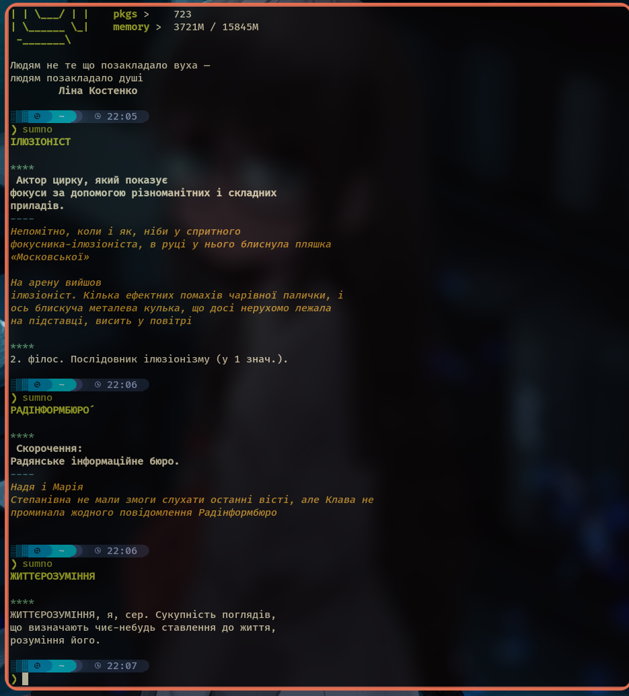

# sumno
Fetch a random word and definition from Ukrainian language dictionary



Досить маленький скрипт який надсилає запит до [Словника української мови в 11 томах](https://github.com/adam-p/markdown-here/wiki/Markdown-Cheatsheet), обирає рандомне слово та друкує його тлумачення разом із прикладами.

Тут ще є багато місця для вдосконалення, і чимало статей відображаються некоректно. Але я просто хотів дивився на щось нове при відкритті терміналу. Я використовував [scraper](https://crates.io/crates/scraper) для обробки html тегів, але я не вебдев та не дуже на цьому розуміюсь. Буду радий запитам на злиття )

***

Щоб встановити - треба мати раст із nightly toolchain та завантажити через cargo.

```
cargo install sumno
```
Або побудувати самому

```
git clone https://github.com/NippleOfAnApe/sumno.git && cd sumno
cargo build --release
```
